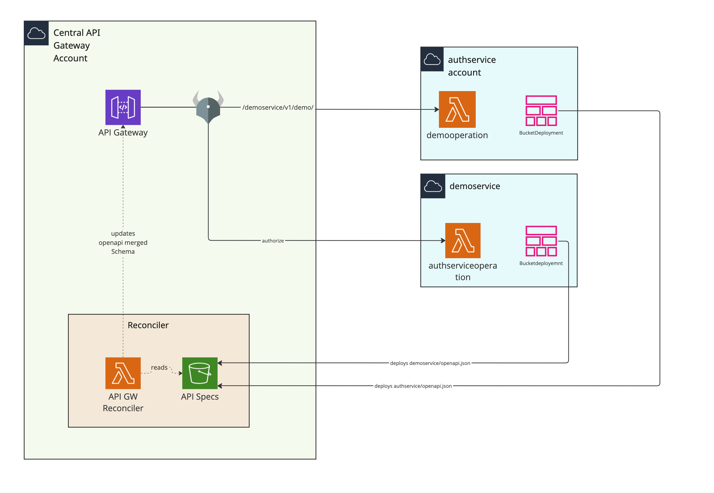

Let's imagine we have 2 services and 1 central api gateway. We want to make 2 services published on central api gateway on their own respective paths and use authservice as authorizer.

For each service and api gateway there dedicated account.

Reconciler solves problem of merging apis of services, as well as managing access to paths on api.

After creating accounts and deploying api, we can deploy reconciler to central api gateway account.

Now, when *authservice* is deployed, it is required from service to deploy openapi schema to reconciler s3 bucket 'API specs'

upload even will trigger 'API GW Reconciler' lambda

'API GW Reconciler' lambda will download all existing specs from 'API specs' s3 bucket, validate, merge and update API GW configuration.





# Example

In this folder we can find 'basic.ts' file with e2e example. Hovewer, there is difference from real world deployment.
For simplicity,  we deploy everything in one stack in one account. Getting and passing parameters between api gw, services  are currently out of scope for this project. In provded example we just short-circuit passing parameters via cdk.


## Before Running

* access to aws account is needed
* aws account was bootstrapped for cdk
* node 18 is required
* aws cdk installed


## Running example


Preparations
```ts
git clone https://github.com/affinidi/api-gw-reconciler.git
cd api-gw-reconciler
npm ci
npx projen
cd examples
```

Deploy
```ts
export DEPLOY_ACCOUNT_ID = <set to aws account id you are deploying too>
export DEPLOY_REGION = <set to aws region you are deploying too>
cdk deploy --app 'npx ts-node basic.ts'
```

## Validation

In example, 2 ways of authorization is provided. AWS_IAM and UserTokenAuth (JWT via lambda)


both can be validated after deployment as such:

```
curl  https://${this.api.restApiId}.execute-api.ap-southeast-1.amazonaws.com/dev/demoservice/v1/demo/sigv4 \
  -H "authorization: Bearer xxx"  \
  -H 'Content-Type: application/json' \
  -d'{"message": "Hello"}'
```


```
curl --aws-sigv4 "aws:amz:ap-southeast-1:execute-api"  \
  https://${this.api.restApiId}.execute-api.ap-southeast-1.amazonaws.com/dev/demoservice/v1/demo/usertoken   \
  -H "x-amz-security-token: $AWS_SESSION_TOKEN" --user "$AWS_ACCESS_KEY_ID":"$AWS_SECRET_ACCESS_KEY"  \
  -d '{"message": "Hello" }'
```


Api doc can be found by url https://${this.api.restApiId}.execute-api.ap-southeast-1.amazonaws.com/dev/api-docs/ui?token=


# Making from scratch

## Create api gw

```ts
//Create API gateway normally or via RefactorSpaces
const api = new apigateway.RestApi(this, 'api', {})
api.root.addMethod('ANY')
```

## Create reconciler 

This could be separate or the same stack as api gw
```ts
const restApiReference = apigateway.RestApi.fromRestApiId(this, 'restApiReference', this.api.restApiId)

const reconciler = new APIGWReconciler(this, 'reconciler', {
    restAPI: restApiReference,
    securitySchemaPath: 'authservice/openapi.json',
    apiDocPathPrefix: 'dev/api-docs',
    apiDocSimpleAuthToken: '',
    openapiHeader: {
      info: {
        title: 'test',
        version: '1.0.2',
        description: 'Central API GW test',
      },
      openapi: '',
      paths: {},
    },  
    allowedAccounts: [
      {
        allowedApiPathPrefix: 'authservice',
        id: Aws.ACCOUNT_ID, //This should be account where *authservice* is deployed
      },
      {
        allowedApiPathPrefix: 'demoservice',
        id: Aws.ACCOUNT_ID, //This should be account where *authservice* is deployed
      },
    ],
})
```

## Deploy services


```ts

//Deploy lambda, prepare scheams

//Service can deploy their openapi schemas via BucketDeployment
new BucketDeployment(this, 'testSchemaDemo', {
  destinationBucket:  // 'API specs bucket'
  destinationKeyPrefix: 'demoservice',
  prune: false,
  sources: [Source.jsonData('openapi.json', testdemoserviceDefinition)],
})
```


